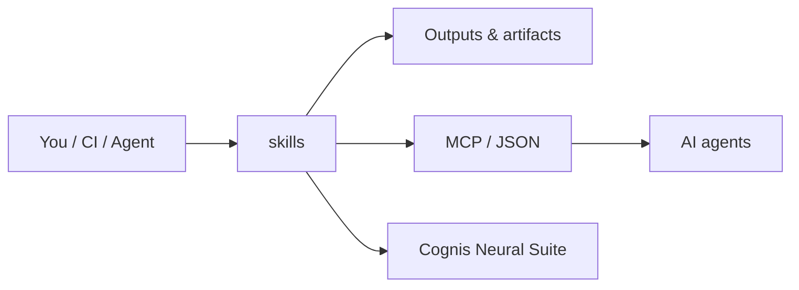

# cognis-skills

An agent **skill registry** for Cognis Digital LLC autonomous agents (ATD trader, cog4 fleet, Mission Control). Skills are self-contained, model-agnostic capabilities an agent can discover, load, and invoke at runtime — in the spirit of ClawHub / Claude-skills manifests.

## What a skill is

A skill is a directory under `skills/` containing:

| File | Required | Purpose |
|------|----------|---------|
| `SKILL.md` | yes | Human + machine-readable manifest with YAML frontmatter + usage docs |
| a script (`run.py`, `run.sh`, ...) | yes | The executable that performs the work |
| supporting files | no | fixtures, schemas, prompt templates |

The top-level `registry.json` indexes every skill so an agent can resolve a name → directory → entrypoint without scanning the tree.

## SKILL.md format

Each manifest opens with YAML frontmatter, then free-form Markdown documentation:

```yaml
---
name: web-search
version: 1.0.0
description: One-sentence trigger so the planner knows WHEN to use this skill.
entrypoint: run.py
runtime: python3
args:
  - name: query
    type: string
    required: true
    description: Search query string.
inputs: { stdin: false }
outputs: { format: json }
permissions: [network]
tags: [research, osint]
---
```

### Frontmatter fields

- **name** — unique, kebab-case. Matches the directory name and the `registry.json` key.
- **version** — semver.
- **description** — a *trigger sentence*. Written so a planner LLM can decide when to invoke without reading the body.
- **entrypoint** — script filename, relative to the skill directory.
- **runtime** — `python3`, `bash`, etc. Determines how the loader execs the entrypoint.
- **args** — ordered list; each has `name`, `type`, `required`, `description`. Passed as `--name value` CLI flags.
- **permissions** — capability tags the host must grant: `network`, `filesystem`, `read-only`, `subprocess`.
- **tags** — free-form discovery labels.

## Invoking a skill

Resolve the entrypoint from the registry and exec it. Scripts are stdlib-only and emit JSON on stdout:

```bash
python3 skills/web-search/run.py --query "critical minerals export controls"
python3 skills/repo-audit/run.py --path .
python3 skills/secret-scan/run.py --path ./src
```

Programmatic loading:

```python
import json, subprocess, sys
from pathlib import Path

reg = json.loads(Path("registry.json").read_text())
skill = reg["skills"]["secret-scan"]
entry = Path("skills") / skill["name"] / skill["entrypoint"]
out = subprocess.run([sys.executable, str(entry), "--path", "."],
                     capture_output=True, text=True)
result = json.loads(out.stdout)
```

## Contract

Every skill MUST:

1. Accept its declared `args` as `--name value` flags.
2. Print a single JSON object to **stdout** (machine output).
3. Print diagnostics to **stderr** only.
4. Exit `0` on success, non-zero on hard failure.
5. Run on stdlib alone unless a `requirements` field declares otherwise (none here do).

## Skills in this registry

| Skill | Description |
|-------|-------------|
| `web-search` | Keyless web/news search via DuckDuckGo + RSS, returns ranked results. |
| `repo-audit` | Static health audit of a repo (size, languages, large files, missing meta). |
| `summarize` | Extractive summarizer for text/Markdown files. |
| `sql-explain` | Parse and explain a SQL statement in plain English. |
| `secret-scan` | Regex + entropy scan for leaked credentials. |
| `changelog` | Generate a changelog section from git history. |
| `compliance-check` | Check a repo for required policy/license/security files. |
| `osint-lookup` | Resolve a domain/host to public footprint signals. |

## How it fits



**Explore the suite →** [🗂️ all tools](https://github.com/cognis-digital/cognis-neural-suite) · [⭐ awesome-cognis](https://github.com/cognis-digital/awesome-cognis) · [🔗 cognis-sources](https://github.com/cognis-digital/cognis-sources)

## License

MIT. (c) 2026 Cognis Digital LLC.
