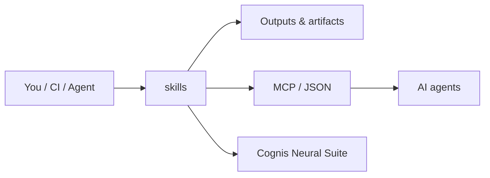

# cognis-skills

An agent **skill registry** for Cognis Digital LLC autonomous agents (ATD trader, cog4 fleet, Mission Control). Skills are self-contained, model-agnostic capabilities an agent can discover, load, and invoke at runtime — in the spirit of ClawHub / Claude-skills manifests.


<!-- cognis:example:start -->
## 🔎 Example output

**Sample result format** _(illustrative values — run on your own data for real findings):_

```
{
  "tools": [
    {
      "name": "hammer",
      "skills": ["nailing", "screwing"],
      "rating": 8
    },
    {
      "name": "drill",
      "skills": ["drilling", "screwing"],
      "rating": 9
    }
  ]
}
```

<!-- cognis:example:end -->

## Usage — step by step

1. **Get the registry** — clone the repo; skills are stdlib-only, so there is nothing to install:
   ```bash
   git clone https://github.com/cognis-digital/skills.git && cd skills
   ```
2. **Discover a skill** via `registry.json`, which maps every skill name to its directory and entrypoint:
   ```bash
   python -c "import json;print(*json.load(open('registry.json'))['skills'])"
   ```
3. **Invoke a skill** by execing its entrypoint with its declared `--name value` args (each skill prints a single JSON object to stdout):
   ```bash
   python3 skills/web-search/run.py --query "critical minerals export controls"
   python3 skills/secret-scan/run.py --path ./src
   ```
4. **Use the output** — stdout is machine-readable JSON, diagnostics go to stderr, and the exit code is `0` on success:
   ```bash
   python3 skills/repo-audit/run.py --path . > audit.json
   ```
5. **Load skills programmatically** from an agent/CI step — resolve the entrypoint from the registry, run it, and parse stdout:
   ```python
   import json, subprocess, sys
   from pathlib import Path
   reg = json.loads(Path("registry.json").read_text())
   s = reg["skills"]["secret-scan"]
   out = subprocess.run([sys.executable, str(Path("skills")/s["name"]/s["entrypoint"]),
                         "--path", "."], capture_output=True, text=True)
   result = json.loads(out.stdout)
   ```

## What a skill is

A skill is a directory under `skills/` containing:

| File | Required | Purpose |
|------|----------|---------|
| `SKILL.md` | yes | Human + machine-readable manifest with YAML frontmatter + usage docs |
| a script (`run.py`, `run.sh`, ...) | yes | The executable that performs the work |
| supporting files | no | fixtures, schemas, prompt templates |

The top-level `registry.json` indexes every skill so an agent can resolve a name → directory → entrypoint without scanning the tree.

## SKILL.md format

Each manifest opens with YAML frontmatter, then free-form Markdown documentation:

```yaml
---
name: web-search
version: 1.0.0
description: One-sentence trigger so the planner knows WHEN to use this skill.
entrypoint: run.py
runtime: python3
args:
  - name: query
    type: string
    required: true
    description: Search query string.
inputs: { stdin: false }
outputs: { format: json }
permissions: [network]
tags: [research, osint]
---
```

### Frontmatter fields

- **name** — unique, kebab-case. Matches the directory name and the `registry.json` key.
- **version** — semver.
- **description** — a *trigger sentence*. Written so a planner LLM can decide when to invoke without reading the body.
- **entrypoint** — script filename, relative to the skill directory.
- **runtime** — `python3`, `bash`, etc. Determines how the loader execs the entrypoint.
- **args** — ordered list; each has `name`, `type`, `required`, `description`. Passed as `--name value` CLI flags.
- **permissions** — capability tags the host must grant: `network`, `filesystem`, `read-only`, `subprocess`.
- **tags** — free-form discovery labels.

## Invoking a skill

Resolve the entrypoint from the registry and exec it. Scripts are stdlib-only and emit JSON on stdout:

```bash
python3 skills/web-search/run.py --query "critical minerals export controls"
python3 skills/repo-audit/run.py --path .
python3 skills/secret-scan/run.py --path ./src
```

Programmatic loading:

```python
import json, subprocess, sys
from pathlib import Path

reg = json.loads(Path("registry.json").read_text())
skill = reg["skills"]["secret-scan"]
entry = Path("skills") / skill["name"] / skill["entrypoint"]
out = subprocess.run([sys.executable, str(entry), "--path", "."],
                     capture_output=True, text=True)
result = json.loads(out.stdout)
```

## Contract

Every skill MUST:

1. Accept its declared `args` as `--name value` flags.
2. Print a single JSON object to **stdout** (machine output).
3. Print diagnostics to **stderr** only.
4. Exit `0` on success, non-zero on hard failure.
5. Run on stdlib alone unless a `requirements` field declares otherwise (none here do).

## Skills in this registry

| Skill | Description |
|-------|-------------|
| `web-search` | Keyless web/news search via DuckDuckGo + RSS, returns ranked results. |
| `repo-audit` | Static health audit of a repo (size, languages, large files, missing meta). |
| `summarize` | Extractive summarizer for text/Markdown files. |
| `sql-explain` | Parse and explain a SQL statement in plain English. |
| `secret-scan` | Regex + entropy scan for leaked credentials. |
| `changelog` | Generate a changelog section from git history. |
| `compliance-check` | Check a repo for required policy/license/security files. |
| `osint-lookup` | Resolve a domain/host to public footprint signals. |
| `todo-scan` | Inventory inline `TODO`/`FIXME`/`HACK` action markers across a tree. |

## Library & CLI (`cognis-skills`)

Beyond the zero-install scripts and the reference `loader.py`, the repo ships an
optional, dependency-free Python library and console command that wrap the same
registry contract. Install it from a checkout:

```bash
pip install -e .
```

Then use the CLI:

```bash
cognis-skills list                 # table of every registered skill
cognis-skills list --json          # machine-readable
cognis-skills run secret-scan --path .
cognis-skills validate             # cross-check registry <-> files <-> manifests
```

Or the typed Python API:

```python
from cognis_skills import list_skills, run_skill, validate

result = run_skill("secret-scan", ["--path", "."])
print(result.ok, result.data["finding_count"])

assert not [i for i in validate() if i.severity == "error"]
```

`cognis-skills validate` is the registry's integrity guard: it verifies that
every entry in `registry.json` points at a real directory and entrypoint, that a
`SKILL.md` exists whose frontmatter `name`/`version`/`entrypoint` match the
registry, and that no skill directory has been added without registering it. It
runs in CI and exits non-zero on any drift.

See **[docs/USAGE.md](docs/USAGE.md)** for the full API and CLI reference.

## Architecture

Three thin layers over one contract — skills (the work), the registry (the
index), and the access layer (`loader.py` + the `cognis_skills` library). A full
diagram and the design rationale live in
**[docs/ARCHITECTURE.md](docs/ARCHITECTURE.md)**.

## Configuration reference

Skills are configured entirely through their CLI flags — there are no config
files or hidden environment inputs. The flags per skill:

| Skill | Flags | Default | Notes |
|-------|-------|---------|-------|
| `web-search` | `--query`, `--max` | `--max 8` | keyless; needs network |
| `repo-audit` | `--path`, `--large-mb` | `--large-mb 5.0` | read-only |
| `summarize` | `--file`, `--sentences` | `--sentences 5` | extractive |
| `sql-explain` | `--sql` (or stdin) | stdin | single statement |
| `secret-scan` | `--path`, `--entropy` | `--entropy 4.0` | exits `1` on findings |
| `changelog` | `--repo`, `--since`, `--version` | `--repo .`, last tag, `Unreleased` | needs git |
| `compliance-check` | `--path`, `--policy` | built-in policy | `--policy` is a JSON file |
| `osint-lookup` | `--host` | — | DoH + system resolver |
| `todo-scan` | `--path`, `--markers` | `TODO,FIXME,HACK,XXX,BUG,OPTIMIZE,DEPRECATED` | exits `1` on findings |

Environment:

- **`PYTHONUTF8=1`** — recommended on Windows to force UTF-8 decoding of inputs.

## FAQ

**Do I need to install anything to run a skill?**
No. Every skill is a standalone stdlib-only script: `python3 skills/<name>/run.py`.
`pip install -e .` is only needed for the optional `cognis-skills` library/CLI.

**What Python versions are supported?**
3.9 through 3.13 (exercised in CI).

**How do skills report success vs. failure?**
Exit `0` on success, `2` on a usage/input error. Audit-style skills
(`secret-scan`, `todo-scan`, `compliance-check`) also exit non-zero when they
*find* something, so they can gate CI or a pre-commit hook.

**Can I add my own skill?**
Yes — create `skills/<name>/` with a `SKILL.md` manifest and an entrypoint,
register it in `registry.json`, then run `cognis-skills validate` to confirm the
wiring. See **[docs/ARCHITECTURE.md](docs/ARCHITECTURE.md)** for the contract.

**Where is the roadmap?**
**[ROADMAP.md](ROADMAP.md)**.

## How it fits



**Explore the suite →** [🗂️ all tools](https://github.com/cognis-digital/cognis-neural-suite) · [⭐ awesome-cognis](https://github.com/cognis-digital/awesome-cognis) · [🔗 cognis-sources](https://github.com/cognis-digital/cognis-sources)

## Interoperability

`skills` composes with the 300+ tool Cognis suite — JSON in/out and a shared
OpenAI-compatible `/v1` backbone. See **[INTEROP.md](INTEROP.md)** for the
suite map, composition patterns, and reference stacks.

## Integrations

Forward `skills`'s findings to STIX/MISP/Sigma/Splunk/Elastic/Slack/webhooks via
[`cognis-connect`](https://github.com/cognis-digital/cognis-connect). See **[INTEGRATIONS.md](INTEGRATIONS.md)**.

## License

MIT. (c) 2026 Cognis Digital LLC.
