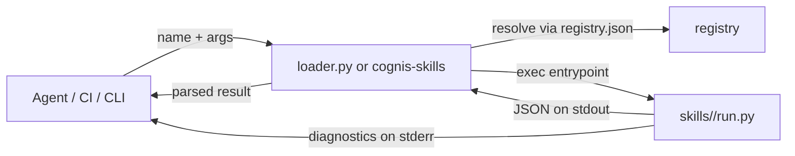

# Architecture

`cognis-skills` is a **registry of self-contained skills**. There is no runtime
framework to buy into: a skill is a script that reads CLI flags and prints a
JSON object. Everything else — the registry index, the reference loader, and the
`cognis_skills` library — exists only to make those scripts easy to discover and
invoke.

## Layout

```
skills/
  registry.json            # index: name -> {path, entrypoint, runtime, ...}
  loader.py                # reference loader: resolve a name and exec it
  <skill>/
    SKILL.md               # manifest (YAML frontmatter) + human docs
    run.py                 # entrypoint: args in, one JSON object out
cognis_skills/             # typed library + `cognis-skills` CLI over the registry
  registry.py              # load/resolve registry entries as Skill dataclasses
  runner.py                # run a skill as a subprocess, parse its JSON
  validate.py              # cross-check registry <-> filesystem <-> manifests
  cli.py                   # `cognis-skills list | run | validate`
livesearch.py              # optional keyless real-time feed/search helper module
tests/                     # pytest suite covering skills + library
```

## The three layers

1. **Skills** (`skills/<name>/run.py`). The unit of work. Each is independently
   runnable with nothing but a Python interpreter. It parses `--name value`
   flags, does one job, and writes a single JSON object to stdout. Exit code is
   `0` on success and non-zero on hard failure (audit-style skills also exit
   non-zero when they *find* something, so they can gate CI).

2. **The registry** (`registry.json`). A flat map from skill name to its
   directory, entrypoint, runtime, declared permissions, and tags. It lets a
   planner resolve `name -> command` without walking the tree. The registry is
   the single source of truth; the `validate` command guards against drift.

3. **The access layer.** Two independent, additive front ends over the same
   contract:
   - `skills/loader.py` — a zero-dependency reference loader (`--list`, run a
     skill by name, pass args through).
   - `cognis_skills` — an installable, typed library plus the `cognis-skills`
     console command. Use it when you want a Python API (`run_skill`,
     `list_skills`, `validate`) or a friendlier CLI.

## Data flow



## The skill contract

Every skill MUST:

1. Accept its declared `args` as `--name value` flags.
2. Print exactly one JSON object to **stdout**.
3. Print diagnostics to **stderr** only.
4. Exit `0` on success, non-zero on hard failure.
5. Run on the standard library alone unless it declares a `requirements` field.

Because the contract is this small, skills compose trivially: the stdout of one
can be piped into another, and any language that can print JSON and parse flags
can implement one.

## Design choices

- **Subprocess isolation.** The library runs each skill in its own process, so a
  crash, a hang (bounded by `timeout`), or heavy imports in one skill cannot
  destabilize the host agent.
- **No hidden state.** Skills do not read config files or environment beyond
  their flags (with the documented exception of `PYTHONUTF8`), which makes their
  output reproducible and cache-friendly.
- **Validation as a first-class concern.** A registry is only useful if it stays
  truthful; `cognis-skills validate` runs in CI to keep `registry.json`, the
  filesystem, and each `SKILL.md` in agreement.
